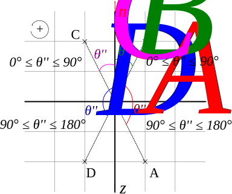

.. _coordinate_system:

=================
Coordinate system
=================

Spherical coordinate system
===========================

.. figure:: spherical_cs.svg
  :width: 50%

  Figure 1: radius, polar angle, azimuth. In ray tracing, the plane (Oxy) is tangent to the surface and the (Oz) is
  normal to the surface. Source:  `Wikimedia <https://commons.wikimedia.org/wiki/File:3D_Spherical.svg>`_.

arim uses the physics (ISO) convention for the `spherical coordinate system (Wikipedia article) <https://en.wikipedia.org/wiki/Spherical_coordinate_system>`_

The radius :math:`r` is in the range :math:`[0, +\infty[` The polar angle theta :math:`\theta` (theta) is in the range
:math:`[0, \pi]`. The azimuth :math:`\varphi` (phi) is in the range :math:`[-\pi, \pi]`.

 .. math::
  \begin{align}
  r&=\sqrt{x^2 + y^2 + z^2} \\
  \theta &= \arccos\frac{z}{\sqrt{x^2 + y^2 + z^2}} = \arccos\frac{z}{r} \\
  \varphi &= \arctan \frac{y}{x}
  \end{align}

where arctan returns an angle in the appropriate quadrant (`atan2 <https://en.wikipedia.org/wiki/Atan2>`_).

.. seealso::

  :func:`arim.geometry.spherical_coordinates`

Coordinate system in ray tracing
================================

For ray tracing, a Cartesian coordinate system is attached to each interface point (this includes probe elements, the
walls and the grid). This coordinate system must be defined such as the plane (Oxy) is tangent to the surface of the
probe elements or walls and the axis (Oz) (either (Oz+) or (Oz-)) points is normal to the surface. There is no such
constraints for the grid points.

In order to retrieve the angles of incidence and/or  transmission of a ray at an interface, it is convenient to express
the coordinates of the incident leg (incoming leg) and the refracted/transmitted leg (outgoing leg) in the coordinate
system attached to the interface point through which the ray goes.

Angles of incidence, reflection, transmission
---------------------------------------------

Angle of the incoming legs: more or less angle of incidence.
Angle of the outgoing legs: more or less angle of reflection and transmission.

The incoming leg is defined as a vector whose origin is the interface point and whose end is the source point (upstream
in the ray) of the leg. Its coordinates :math:`(r, \theta, \phi)` are given in the coordinate system attached to the
interface point.

The **unsigned angle of incoming leg** is the polar angle :math:`\theta`. It is in the range :math:`\left[0, \pi\right]`.

The **signed angle of incoming leg**, which has values in :math:`\left[-\pi, \pi\right]`, is defined as follow:

.. math::

  \begin{align}
  \theta' &= \begin{cases}
    \theta & \mbox{if } \varphi \in \left]-\frac{\pi}{2}, \frac{\pi}{2}\right] \mbox{ (mod } 2\pi \mbox{)}\\
    -\theta & \mbox{otherwise}
  \end{cases}
  \end{align}

The **conventional angle of incidence**, which has values in :math:`\left[0, \pi\right]`, takes into account the
direction of the user-defined normal which could be either (Oz+) or (Oz-):

.. math::

  \begin{align}
  \theta'' &= \begin{cases}
    \theta = \arccos\frac{z}{r} & \mbox{if the conventional surface normal is } (Oz^+)\\
    \pi - \theta = \arccos\frac{-z}{r} & \mbox{if the conventional surface normal is } (Oz^-)
  \end{cases}
  \end{align}

The conventional surface normal for incoming rays is set up in the attribute
:attr:`arim.core.Interface.are_normals_on_inc_rays_side`: True if (Oz+), False if (Oz-).

The **angles of outgoing legs** are defined similarly with the exception that the outgoing leg is a vector whose origin
is the interface point and its end is the destination point (downstream in the ray). The conventional surface normal for
outgoing rays are defined :attr:`arim.core.Interface.are_normals_on_out_rays_side`.

.. figure:: unsigned_angles.svg
  :width: 50%

  Unsigned angles in plane (Oxz).

.. figure:: signed_angles.svg
  :width: 50%

  Signed angles in plane (Oxz).

.. figure:: conv_angles_plus.svg
  :width: 50%

  Conventional angles in plane (Oxz) with surface normal along (Oz+).

  Conventional angles in plane (Oxz) with surface normal along (Oz-).

.. seealso::

  :mod:`arim.geometry`
